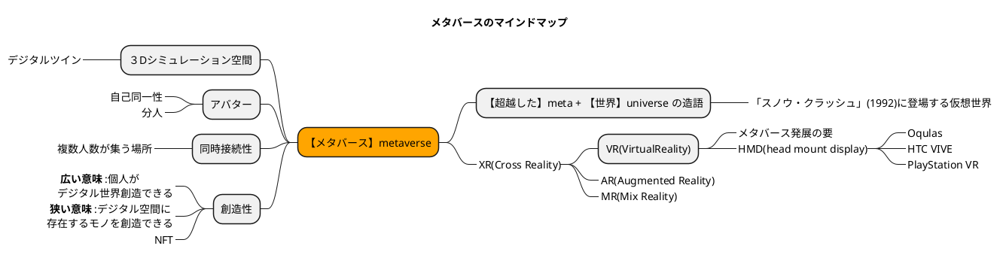

# 0.メタバースとは何か？

## 0-1.メタバースという言葉

- **【メタバース】metaverseは、 【超越した】meta + 【世界】universe** を組み合わせた造語
    - 「スノウ・クラッシュ」(1992)に登場する仮想世界の名前 ※アメリカのSF作家・ニール・スティーヴンスンが1992年に発表したSF小説
    > スノウ・クラッシュ (全2巻) (ハヤカワ文庫SF)  
    > <https://www.amazon.co.jp/gp/product/B09R4G6JQ9?ref_=dbs_p_mng_rwt_ser_shvlr&storeType=ebooks>  
    - 小説の中では、インターネット上の仮想空間（情報によって構築されたサイバー空間）として扱われている。

## 0-2.メタバースの定義

- 現実（Reality）とは別な第2の世界 = 仮想現実「VR（Virtual Reality)」という現実とは別のデジタル空間。
    - その特徴として以下の側面を持っている。
        - 現実をシミュレーションすることが空間。
        - 複数の人が同じ空間で活動することができる。
        - アバタを通して現実とは別な自分で活動することができる。
        - デジタル空間は自由な経済圏を持つことができ、個人で様々なモノが創造することができる。
- 利用者は、HMD（ヘッドマウントディスプレイ）デバイスを通じてデジタル空間で活動することができる

### 補足

- 【VR（Virtual Reality）】: 仮想現実 - ヘッドマウントディスプレイや専用ゴーグルを体験できる世界
- 【AR（Augmented Reality）】: 拡張現実 - 現実世界コンピューターの情報を画像やを重ね合わせたて現実世界をコンピューター情報によって拡張した世界
- 【MR（Mix Reality）】: 複合現実 - 現実現実と仮想現実をより密接に複合化された世界。拡張現実が情報の投影に対して、複合現実は仮想現実にあるものが触れることのできるなどがより現実化したもの。
- 【XR（Cross Reality）】: 上記の総称

### さまざまな定義

---

#### アメリカ企業におけるメタバースの定義

---
!!! note
    - 僕はメタバースとは、人類の描いた夢の生活スタイルのことだと考えている。  
    > 引用: メタバース　さよならアトムの時代 (集英社ノンフィクション）加藤直人（著）
    - メタバースですが、これはVR、AR、MR、XR、ミラー・ワールドのブランディングと言い切っていいでしょう。  
    > 引用: メタバースとWeb3 國光 宏尚 (著）  
    - メタバースの世界は、カセットゲーム時代の『ドラゴンクエスト』のように「すでにでき上った完成品」ではありません。ネット上にオープンソースとしてアップロードされた世界は、ユーザーがいくらでも作り換えることが可能です。  
    > 引用: 世界2.0　メタバースの歩き方と創り方 (幻冬舎単行本）佐藤航陽(著）  

---
!!! 参考資料
    > 注目の「XR」（クロスリアリティ）とは？VR、AR、MRとの違いと最新事例を紹介  
    > <https://time-space.kddi.com/ict-keywords/20180816/2406>  

    > メタバース進化論――仮想現実の荒野に芽吹く「解放」と「創造」の新世界 バーチャル美少女ねむ(著)  
    > <https://www.amazon.co.jp/dp/B09V4Y8WJG/ref=dp-kindle-redirect?_encoding=UTF8&btkr=1>  

    > メタバースとWeb3 國光 宏尚 (著)  
    > <https://www.amazon.co.jp/dp/B09W9B5Q6H/ref=dp-kindle-redirect?_encoding=UTF8&btkr=1>  

    > 世界2.0　メタバースの歩き方と創り方 (幻冬舎単行本) 佐藤航陽  (著)  
    > <https://www.amazon.co.jp/dp/B09W98T3SX/ref=dp-kindle-redirect?_encoding=UTF8&btkr=1>  

    > メタバース　さよならアトムの時代 (集英社ノンフィクション) 加藤直人  (著) 
    > <https://www.amazon.co.jp/dp/B09TT11YPF/ref=dp-kindle-redirect?_encoding=UTF8&btkr=1>

    > No.354 AR/VRを巡るプラットフォーム競争における日本企業の挑戦  
    > <https://www.dbj.jp/upload/investigate/docs/15b521ee498fac61aec71ff2d93da2e6_1.pdf>  
