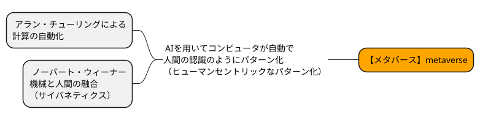

# 1.より深いメタバース

- 歴史的な観点からメタバースを深堀り

## 1-1. 計算の自動化

- メタバースは、現実世界をコンピューターの **計算** によってシミュレーションしたデジタル空間を実現しようとしている。
- **計算** の歴史は「手動で計算していたこと」から「コンピューターを用いて自動で計算する」ように変わっていった。人間の手から計算が切り離された。
    - 数学者 `ダフィット・ヒルベルト（1862－1943）` の「数学的な手順はすべて機械こなせる」というアイディアに惹かれた `アラン・チューリング（1912-1954）` が、計算の自動化をするという観点でコンピューターの原型を作った。  
    ※アラン・チューリングは、現代コンピューター科学の父と呼ばれている。
- 計算が自動化できた要因は、プログラム（計算するもの）と、データ（計算されるもの）が **定式化（formulation）** されたため。
    - 定式化とは、「目的に対してデータを用いてどのようなプログラムで計算結果を出すか」を明示的にすること。
- 定式化されたことで、自動で計算された結果（情報）はインターネットの登場で計算量が大幅に増え情報の革命時代となった。

## 1-2. 機械と人間の融合

- `ノーバート・ウィーナー（1894-1964）`は、生体を自動機械とみなし自動制御の理論「サイバネティクス」を適応した。
- 人間の行動原理は、人間の感覚（視覚、聴覚、嗅覚、味覚、触覚）を神経を通じ行動に起こす。
- 「情報を **通信** し行動を **制御** する」こと自体を機械が行うという考え方が「サイバネティクス」と言われる。
    - この発想が、さまざまな学問に影響を与え世界の機械と人間の融合を加速させた。

> 計算の自動化 ＋ サイバネティクス
> 計算を人間から切り離し、人間そのものを計算させる。
> この営みこそが「メタ」

## 1-3. 人間の知性 ＝ パターンの発見

- 人の認識 → 情報をパターン化する事で少ない情報に「圧縮」させることができる。
- たとえば、石の原素数は10の25乗あり、人間は10の10乗といわれる。人間より石の方がより複雑な原素で構成されているが、石よりも人間の原素が少ないと考えながら生活している人は少ない。
- 川原にある石はすべて石で「石同士の違いは色や形だけの違いぐらい」しか人間は認識していない。

- 人間は必要がない情報は「圧縮」して認識する事でパターン化している。それを、人間中心「ヒューマンセントリック」と呼ぶ。

- メタバースは、ヒューマンセントリックに情報をパターン化した世界を作ろうとしている。 → パターン化で重要なのは人間の認識の仕方を機械で行う必要がある。
それにはAIが必要となる。

!!! note
    > **現存するもっともメタバースに近いシステムは脳なのじゃないかと思っている。——— 人類がめざすべき最終的なメタバースのあり方は、全人類の脳をつなげたものなのかもしれない。** 
    > _加藤直人 メタバース　さよならアトムの時代より_  
    > <https://www.amazon.co.jp/dp/B09TT11YPF/ref=dp-kindle-redirect?_encoding=UTF8&btkr=1>

---

## [参考資料]

> 定数化とは - <https://www.nifs.ac.jp/info/Unit-007.pdf>  
> 停止性問題 - <https://eng-blog.iij.ad.jp/archives/3095>  
> サイバネティックス－舵をとる人－ - <https://youtu.be/CNBPcimiLH0>  
