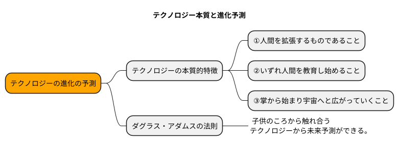
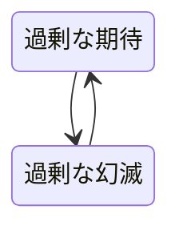
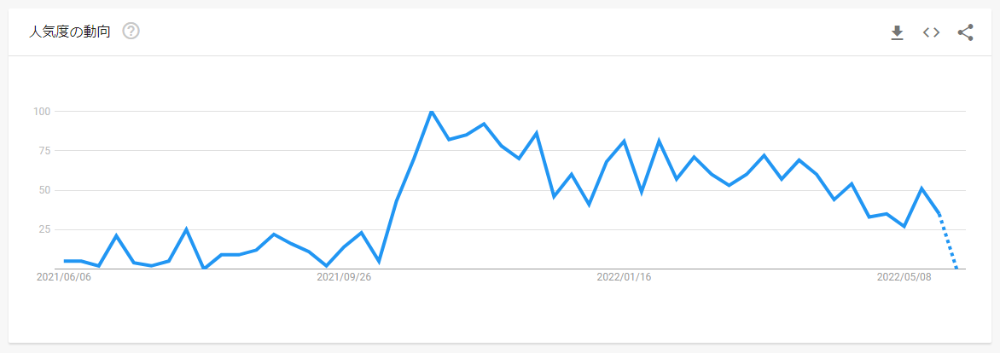

# 2. テクノロジーの進化の予測

メタバースには限らず、テクノロジーの進化を予測することができれば、  
今後の自分の将来に何ができるかを見極めて経済的な成功を収まることができるのでないか。

## あらゆるテクノロジーの本質的な特徴

- **①人間を拡張するものであること**
    - 「1.より深いメタバース」で述べた計算の自動化、機械と人間の融合のように人の能力の拡張を行ってきた。
    - 蒸気や電力（アトム）といったテクノロジー →「動力革命」
    - コンピューターは脳内における →「知能革命」
- **②いずれ人間を教育し始めること**
    - 新しいテクノロジーの普及から時間がたつと、テクノロジーに合わせて生活を変化させる。
    - 必要な情報を人に合わせて提示したりすることが可能になった。ブラウザのサジェストなど
- **③掌から始まり宇宙へと広がっていくこと**
    - テクノロジーの発展していく法則性がある。
        - 人間のもつ機能の拡張は「身体の近く」から始まる。
        - 武器や靴などの手足の拡張から、車や飛行機、宇宙船まで身体の近くから初めまりテクノロジーの発展によって身体から離れている。
    - テクノロジーの浸透する法則性がある。
        - 浸透する順番としては、「消費者（初年度）→ 企業（3～5年後）→ 行政（3～5年後）」へ浸透する。
        - 意思決定が身軽な順から浸透する。

## 子供のころから触れ合うテクノロジーから未来予測

!!! summary "ダグラス・アダムスの法則"
    - ダグラス・アダムス（1952-2001）イギリスの脚本家、SF作家 代表作「銀河ヒッチハイクガイドシリーズ」
    > 人は、自分が生まれたときにすでに存在していたテクノロジーを自然な世界の一部と感じられる。  
    > 15歳から35歳の間に発明されたテクノロジーに関しては新しくエキサイティングなものとして感じられる。  
    > 35歳以降になって発明されたテクノロジーは、自然に反するものとして感じられる。  

- 経済的な成功のための適切なタイミングを読む方法として、  
一部のギーグ（技術オタク）が熱狂していて、それ以外の人がピンと来ていない・理解できないという状態が、取り掛かるタイミングとしてベスト。

- 新しいテクノロジーは「過剰な期待」と「過剰な幻滅」を交互にさらされながら普及していくというサイクル

- 現在は幻滅期入っていると思われる。

- 全世界のトレンド推移

- 日本でのトレンド推移
