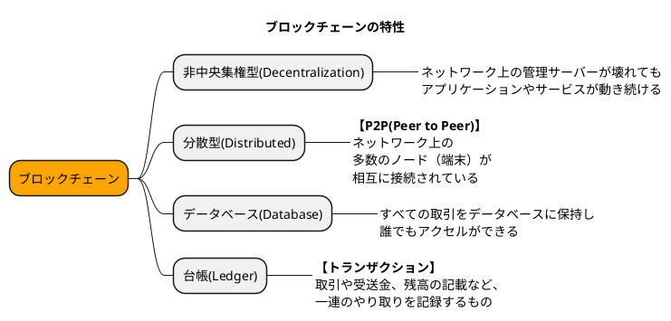

# 00.ブロックチェーンの特性

## ブロックチェーン

ブロック（トランザクション群の箱）の連鎖

- ブロックとは、複数のトランザクション（取引）を格納したもの
- チェーンはそのブロックをつなげるもの  
    - つなげることは誰でもできて、さまざまな暗号計算を用いてつなぐことができる。 → **マイニング**
    - つなげるための暗号が必要 → 暗号通貨、暗号資産といわれる所以
    - トランザクション群を暗号計算してつなげることで不可逆的に記録することができる → 不可逆的:変更することのできない
    - すべての暗号通貨、暗号資産の実際の取引はネットワーク上にすべて公開されてる
        - ビットコインの実際の取引 - <https://www.blockchain.com/explorer>
        - {:target="_blank"}  
            - `Latest Blocks`がブロックを繋げた記録
            - `Latest Transactions`が取引した記録
- **非中央集権** と **分散** を実現するために、 **ブロックチェーン** が必要
  
---

### イーサリアムとは

- 世界第二位の暗号通貨 ※第一位はビットコイン
- 公式サイト - <https://ethereum.org/ja/> ※公式がより深くブロックチェーンついて学習できるが、ほとんど英語。。。
- ビットコインでは、`コインの取引（トランザクション）`を発行してブロックを繋げていた
- イーサリアムでは、`コインの取引以外に株や土地、デジタルコンテンツなど`さまざま取引を行えることができる
- 幅広い取引ができるようになったため、イーサリアムベースでさまざまなテクノロジーが開発されている
    - 非代替性トークン（NFT:Non-Fungible Token）
    - 分散型金融（DeFi:Decentralized Finance）
    - 分散型自律組織（DAO:Decentralized Autonomous Organization）
- プラットフォームとしてイーサリアムが今日にいたるまで存在感を増している

### スマートコンストラクター

- いろいろな取引を行うための技術としイーサリアムには取引（トランザクション）を自動で実行するスマートコンストラクという機能が存在する
- スマートコンストラクターの開発には、`Solidity`という言語で開発している

---

#### 参考資料

- Ethereumのスマートコントラクトを実行してみよう - <https://zenn.dev/kihonkei/articles/d81f324caf29e9>
