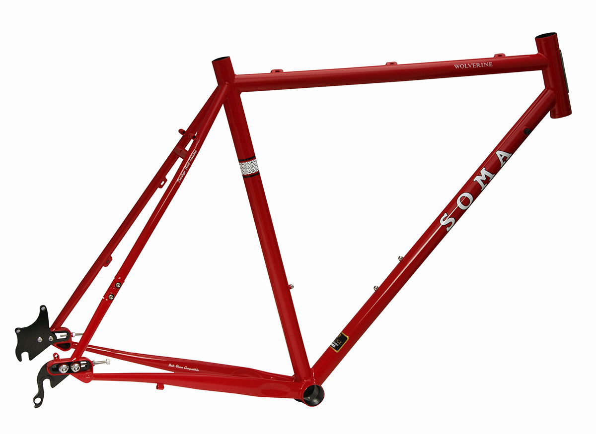
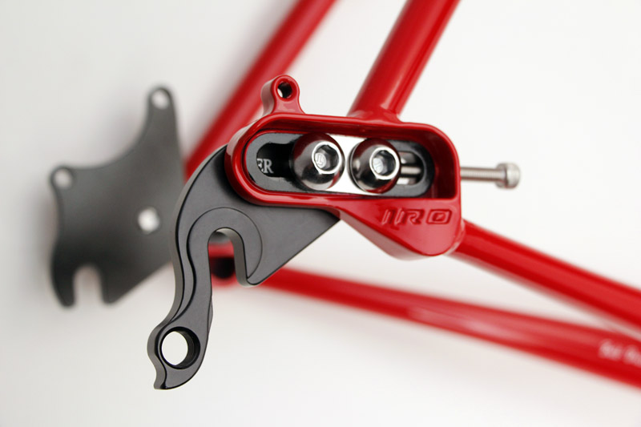
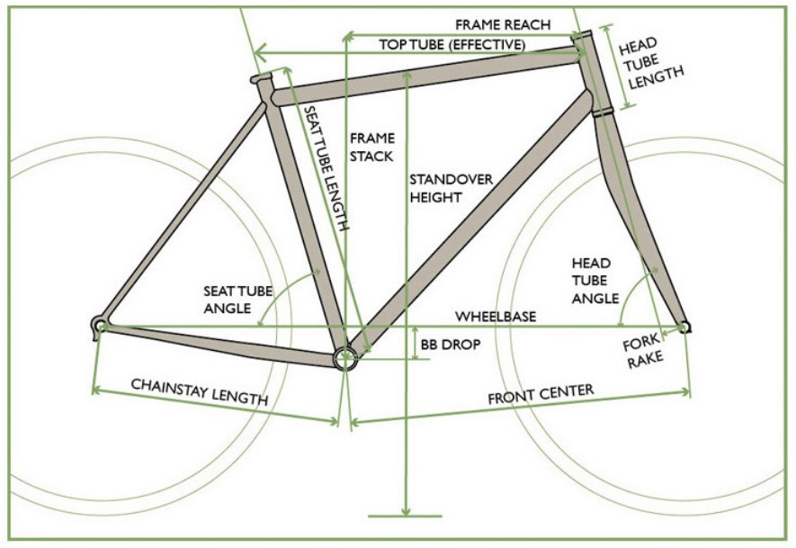
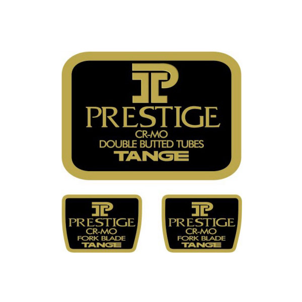

# FRAME（フレーム）

SOMA FabricationsのWolverine (V.3.0)を購入  
  

## SOMA Fabrications

:::info
SOMA Fabricationsは、American CycleryのオーナーであるBradley Woehl氏が、The Merry Sales Co.の社長であるJim Porter氏に、台湾でクロモリ鋼の自転車用フレームを生産してもらえないかと相談したことから生まれたブランドである。それ以来、WoehlとPorterは、このブランドのための製品アイデアを共同開発するようになりました。  
[引用 Wiki]https://en.wikipedia.org/wiki/SOMA_Fabrications
:::

## Wolverine

SOMA FabricationsのサイトにWolverine (V.3.0)のページがあるが、Retired（退任？）と記載されていた。すでに生産は終わっているみたい。
<https://www.somafab.com/archives/product/wolverine30>

### フレームについての紹介文

:::info
> #### 【冒頭】
> ウルヴァリンの原点は「モンスタークロス」ですが、マジでそれ以上なんです。  
> オフロードツーリングに適した安定したジオメトリーと、オールラウンドなアドベンチャーに適したスポーティーなジオメトリー。ドロップアウトをスライドさせれば、シングルスピードのCXバイクにも変身する。  
> スプリットシートステーを採用し、ゲイツカーボンベルトドライブとの互換性があります。
:::

**【用語】**
- `モンスタークロス` = (29er + シクロクロス / 2 ) のバイク
  - ※29er = 29インチMTB
- `ドロップアウト` = リアタイヤが付く爪
- `CXバイク`（シクロクロスバイク） = シクロクロスは、オフロードで行われる自転車競技なので、オフロード競技用の自転車
- `スプリットシートステー` = シートステーの一部がスプリット(分裂)する事で、カーボンドライブベルトを装着できる箇所
  > 
  > [画像引用](https://www.bikechaser.com.au/news/choose-right-bike-size/)
- `ゲイツのカーボンベルトドライブ` = 読んで字のごとく
  <https://www.gates.com/jp/ja/industries/micromobility/bicycles.html>  
  <https://www.gatescarbondrive.com/bike>

:::info
> #### 【キャプチャ1】
> v.3.0では、新たに堅牢なIRD Broski Sliding Dropoutsが採用されました。また、溶接方法を変更し、チューブ全体の強度をより保つようにしました。
>
:::

**【用語】**
- `IRD Broski Sliding Dropouts` = 下の画像のパーツ、リアのエンドを変えるパーツ
  > 
  > 参考:<https://www.interlocracing.com/shop/94850-tange-ird-sliding-dropouts-full-set-3899#attr=>

- `チューブ` = フレームの各部位の事。なぜチューブと呼ぶのだろうか？空洞だから？

:::info
- タンゲプレステージ熱処理ダブルバテッドCrMoフロントトライアングル、バテッドCrMoリアエンド

- 700x45cのタイヤが装着可能（フェンダー付き

- リアハブ互換性：135mm QR（アフターマーケットインサートにより142 x 12スルーアクスルに変換可能

- ゲイツカーボンベルトドライブ対応

- オプションのマッチングフォーク。
A) 標準QRアクスルのラグドフラットクラウン、タンゲインフィニティCrMoスチールフォーク、ダブルアイレットパニアラックおよびミニラックマウント。
B)超高剛性ユニクラウンストレートブレード15mmスルーアクスルフォーク（2019年にはデュアルミッドブレードボスを装備）。
:::

- `タンゲプレステージ` = ダウンチューブ（BBからヘッドチューブのまでのチューブ）にシールが貼っているのがタンゲプレステージ
  タンゲプレステージはもともと日本の工場で製造されているいたが、現在は台湾で製造している。

----
[参考資料]

- Soma公式サイト:[https://www.somafab.com/](https://www.somafab.com/)

- [【試乗車】SOMA Wolverine 期間限定](https://ysroad.co.jp/higashiyamato/2018/07/02/31590)
- [ソーマのデザイナー・エヴァン氏と共に巡る東京のバイクカルチャートリップ](https://www.cyclowired.jp/lifenews/node/235638)

- Somaの姉妹ブランド [NEW ALBION CYCLES - http://newalbioncycles.com/](http://newalbioncycles.com/)
- ソーマの姉妹ブランド NEW ALBION　様々な遊び方ができるグラベルロードDrake [https://www.cyclowired.jp/news/node/291676](https://www.cyclowired.jp/news/node/291676) 

- Somaの製品デザイナーのBradley Woehlさん - <https://www.linkedin.com/in/bradley-woehl-22914813>
  - 2021年まで製品デザイナーをしていたようです。

- [https://www.americancyclery.com/](https://www.americancyclery.com/)

- 自転車のフレームジオメトリって大事！後悔のないロードバイク選び。- <https://www.cb-asahi.co.jp/blog/howto/124/>

- All Parts Of A Bicycle Explained: Comprehensive Guide To Your Bike - <https://biketips.com/parts-of-a-bicycle-explained/>