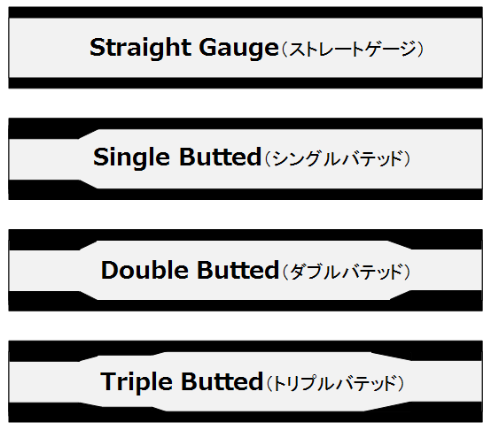
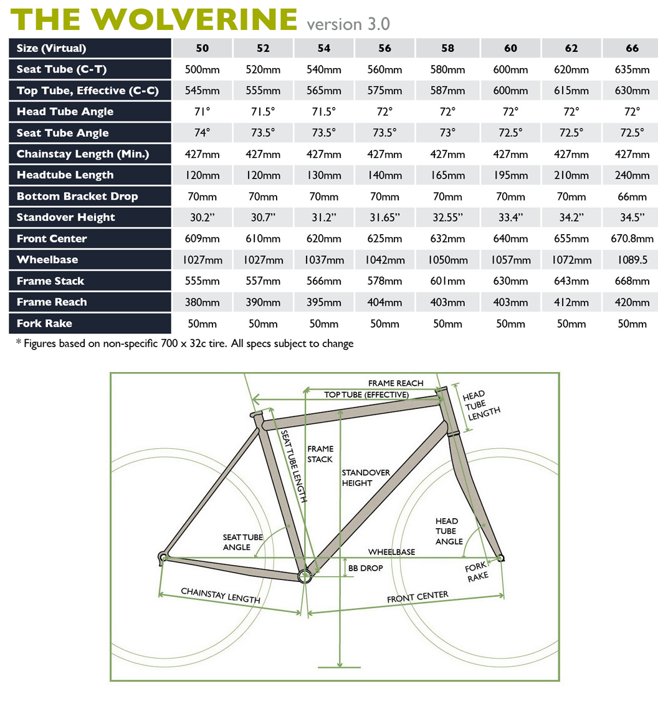

# FRAME（フレーム）

SOMA FabricationsのWolverine (V.3.0)を購入  
  

## SOMA Fabrications

:::info
SOMA Fabricationsは、American CycleryのオーナーであるBradley Woehl氏が、The Merry Sales Co.の社長であるJim Porter氏に、台湾でクロモリ鋼の自転車用フレームを生産してもらえないかと相談したことから生まれたブランドである。それ以来、WoehlとPorterは、このブランドのための製品アイデアを共同開発するようになりました。  
[引用 Wiki]https://en.wikipedia.org/wiki/SOMA_Fabrications
:::

## Wolverine

SOMA FabricationsのサイトにWolverine (V.3.0)のページがあるが、Retired（退任？）と記載されていた。すでに生産は終わっているみたい。
<https://www.somafab.com/archives/product/wolverine30>

### フレームについての紹介文

:::info
Wolverineの原点は「モンスタークロス」ですが、マジでそれ以上なんです。  
オフロードツーリングに適した安定したジオメトリーと、オールラウンドなアドベンチャーに適したスポーティーなジオメトリー。ドロップアウトをスライドさせれば、シングルスピードのCXバイクにも変身する。  
スプリットシートステーを採用し、ゲイツカーボンベルトドライブとの互換性があります。  
> 原文:The original inspiration for the Wolverine was "monster cross", but it is seriously so much more. Its geometry is stable enough for off road touring, but sporty enough for all-around adventure. With its sliding dropouts, you can turn it into a single-speed CX bike. With a split seatstay, it is compatible with the Gates Carbon Belt Drive.
:::

**【用語】**
- `モンスタークロス` = (29er + シクロクロス / 2 ) のバイク
  - ※29er = 29インチMTB
- `ドロップアウト` = リアタイヤが付く爪
- `CXバイク`（シクロクロスバイク） = シクロクロスは、オフロードで行われる自転車競技なので、オフロード競技用の自転車
- `スプリットシートステー` = シートステーの一部がスプリット(分裂)する事で、カーボンドライブベルトを装着できる箇所
  > 
  > [画像引用](https://www.bikechaser.com.au/news/choose-right-bike-size/)
- `ゲイツのカーボンベルトドライブ` = 読んで字のごとく
  <https://www.gates.com/jp/ja/industries/micromobility/bicycles.html>  
  <https://www.gatescarbondrive.com/bike>

:::info
v.3.0では、新たに堅牢なIRD Broski Sliding Dropoutsが採用されました。また、溶接方法を変更し、チューブ全体の強度をより保つようにしました。  
> 原文:The v.3.0 has the new robust IRD Broski Sliding Dropouts. We also switched up the welding method to keep more of the tube's overall strength.
>
:::

**【用語】**
- `IRD Broski Sliding Dropouts` = 下の画像のパーツ、リアのエンドを変えるパーツ
  > 
  > 参考:<https://www.interlocracing.com/shop/94850-tange-ird-sliding-dropouts-full-set-3899#attr=>

- `チューブ` = フレームの各部位の事。なぜチューブと呼ぶのだろうか？空洞だから？

:::info
- タンゲプレステージ熱処理ダブルバテッドCrMoフロントトライアングル、バテッドCrMoリアエンド  
> 原文: - Tange Prestige heat-treated double butted CrMo front triangle; butted CrMo rear end
:::

- `タンゲプレステージ` = フレーム製造を行っている日本ブランドのTANGEの代表モデル。プレステージモデルは、1984年に誕生。※もともと日本の工場で製造されているいたが、現在は台湾で製造している。  
Wolverineのダウンチューブ（BBからヘッドチューブのまでのチューブ）にシールが貼っている  
> TANGEについての資料：<https://funq.jp/bicycle-club/article/10469/>

- `熱処理` = 焼き入れ処理 → 金属に高熱を加えて高温状態にし、急冷することで硬化させる処理

- `ダブルバテッド` - チューブの肉厚が途中で変化する（中央部分が薄い）もの。

> バデットについての資料
> -ロードバイク｜現行スチールパイプカタログ -TANGE & KAISEI - <https://www.daiwa-cycle.jp/feature/column/15>
> - ロードバイクの選び方 ～ フレーム素材編 その③ ～ - <https://www.sbtm.jp/b<og/<-156/>
> - バテッドって何？ - <https://www.a-dew.com/knowledge/frames/butted>

:::info
- 700x45cのタイヤが装着可能（フェンダー付き

- リアハブ互換性：135mm QR（アフターマーケットインサートにより142 x 12スルーアクスルに変換可能

- ゲイツカーボンベルトドライブ対応

- オプションのマッチングフォーク。  
A) 標準QRアクスルのラグドフラットクラウン、タンゲインフィニティCrMoスチールフォーク、ダブルアイレットパニアラックおよびミニラックマウント。  
B)超高剛性ユニクラウンストレートブレード15mmスルーアクスルフォーク（2019年にはデュアルミッドブレードボスを装備）。

> 原文:  
> - Clearance for 700x45c tires w/ fenders
> 
> - Rear hub compatibility:135mm QR (convertible to 142 x 12 thru-axle with aftermarket inserts
> 
> - Gates Carbon belt drive compatible
> 
> - Optional matching forks:
> A) lugged flat crown standard QR axle, Tange Infinity CrMo steel fork; double eyelets pannier rack and mini rack mounts.  
> B) Extra stiff unicrown straight blade 15mm thru-axle fork (w/ dual mid-blade bosses in 2019)
:::

- `700x45c` = タイヤ外径700mm x タイヤ幅45mm、`c`はリム直径広を表す。
  - 参考:タイヤサイズについて - <https://www.cycle-yoshida.com/pc/freepage.php?NUM=82>

### ジオメトリ

サイズ52を購入。トップチューブがスローピングしているので

----
[参考資料]

- Soma公式サイト:[https://www.somafab.com/](https://www.somafab.com/)

- [【試乗車】SOMA Wolverine 期間限定](https://ysroad.co.jp/higashiyamato/2018/07/02/31590)
- [ソーマのデザイナー・エヴァン氏と共に巡る東京のバイクカルチャートリップ](https://www.cyclowired.jp/lifenews/node/235638)

- Somaの姉妹ブランド [NEW ALBION CYCLES - http://newalbioncycles.com/](http://newalbioncycles.com/)
- ソーマの姉妹ブランド NEW ALBION　様々な遊び方ができるグラベルロードDrake [https://www.cyclowired.jp/news/node/291676](https://www.cyclowired.jp/news/node/291676) 

- Somaの製品デザイナーのBradley Woehlさん - <https://www.linkedin.com/in/bradley-woehl-22914813>
  - 2021年まで製品デザイナーをしていたようです。

- [https://www.americancyclery.com/](https://www.americancyclery.com/)

- 自転車のフレームジオメトリって大事！後悔のないロードバイク選び。- <https://www.cb-asahi.co.jp/blog/howto/124/>

- All Parts Of A Bicycle Explained: Comprehensive Guide To Your Bike - <https://biketips.com/parts-of-a-bicycle-explained/>